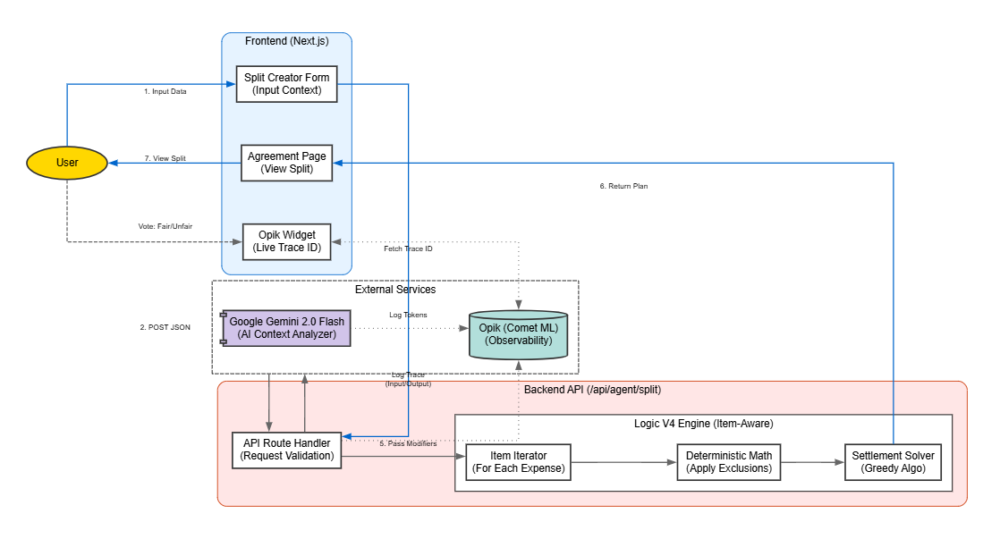

# RoomTab: The Fairness Engine 🧾

> **Stop arguing about the bill. Let Logic handle it.**

RoomTab is an AI-driven fairness engine for splitting shared costs, built for the **Amadeus Genesis Hackathon**. It goes beyond simple math to understand the *nuance* of shared costs-solving the "Silent Tax" of being the roommate who arrives late, doesn't drink, or eats less.

[](https://www.comet.com/opik) [](https://nextjs.org/) [](https://deepmind.google/technologies/gemini/)

## Why Simple Splits Fail

Existing split apps are calculators, not arbiters. They force you to manually input who owes what, leading to social friction.
*   "Does Alice pay for the Uber if she fell asleep in the back?"
*   "Bob is vegan, so he shouldn't pay for the steak."
*   "Charlie arrived 2 days late to the Airbnb."

Manually adjusting these spreadsheets is a nightmare.

## The Solution: Item-Aware Logic (V4)

RoomTab uses **Google Gemini 2.0 Flash** combined with a custom **Item-Iterative Deterministic Engine**.
1.  **AI Judge**: It reads your natural language context ("Jack didn't use gas") to assign specific *Role Tags* to participants (e.g., `exclude:gas`, `partial:rent`).
2.  **Deterministic Math**: A rigorous algorithm calculates exact splits down to the cent. No AI hallucinations. No "floating math."
3.  **Traceability**: Every decision is logged to **Opik** for full transparency and **auditability**.

## Hackathon Features

### 1. Deep Observability (Opik Integration)
We didn't just add logging; we built our debugging loop on Opik.
*   **Live Signals**: The frontend displays the real-time Trace ID and Latency.
*   **Safety Tags**: We push semantic tags like `scenario:exclusion` and `model:gemini-2.0-flash` to Opik for dataset analysis.
*   **Fairness Audit**: A dedicated `/audit` page verifies our logic against edge cases like "The Freeloader King" (Pays $0) or "The Strict Vegan" (Item isolation).

### 2. Zero-Friction UX
*   **Dynamic Templates**: Instant context switching between "Trip", "Rent", and "Dinner".
*   **Settlement Plans**: Calculates the minimum number of transactions to settle debts ("Alice pays Bob $50").
*   **Multi-Currency**: Seamlessly handles USD, EUR, INR, and more.

## High-Level Architecture



## Technology Stack

*   **Frontend**: Next.js 15 (App Router), Tailwind CSS
*   **Backend**: Next.js API Routes (Edge-ready)
*   **AI**: Gemini 2.0 Flash (via Vercel AI SDK)
*   **Observability**: Opik SDK (Comet ML)
*   **Storage**: Ephemeral / Privacy-First (LocalStorage)

## Getting Started within 2 Minutes

**Don't have API keys?** Try the [Live Demo](https://room-tab.vercel.app/) instead.

1.  **Clone & Install**
    ```bash
    git clone https://github.com/GokhanCey/RoomTab.git
    cd RoomTab
    npm install
    ```

2.  **Environment Setup**
    Create `.env.local`:
    ```env
    GEMINI_API_KEY=your_key_here
    OPIK_API_KEY=your_key_here
    ```

3.  **Run**
    ```bash
    npm run dev
    ```
    Visit `http://localhost:3000`.

## Verified Scenarios

We put RoomTab through the "Absurdity Test" to ensure robustness:

| Scenario | Input Context | Result |
| : -- | : -- | : -- |
| **The Vegan** | "Bob is vegan and didn't eat steak." | **PASS**: Bob pays $0 for steak, fair share of salad. |
| **The Late Arrival** | "Alice arrived 2 days late." | **PASS**: Alice pays pro-rated rent. |
| **The Ghost** | "King says he pays nothing." | **PASS**: King pays $0, others cover the cost (or user rejects plan). |
| **The Micro-Usage** | "Dave watched 13 mins of the movie." | **PASS**: Dave pays exactly ~11% of the ticket. |

## Links

*   **Live Demo**: [https://room-tab.vercel.app/](https://room-tab.vercel.app/)
*   **Video Walkthrough**: [https://youtube.com/tbu](https://youtube.com/tbu)
*   **Source Code**: [https://github.com/GokhanCey/RoomTab](https://github.com/GokhanCey/RoomTab)
*   **Pitch Deck**: [https://github.com/GokhanCey/RoomTab/blob/main/PD.pdf](https://github.com/GokhanCey/RoomTab/blob/main/PD.pdf)

*Project submitted by Team RoomTab.*
